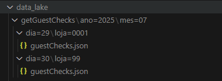
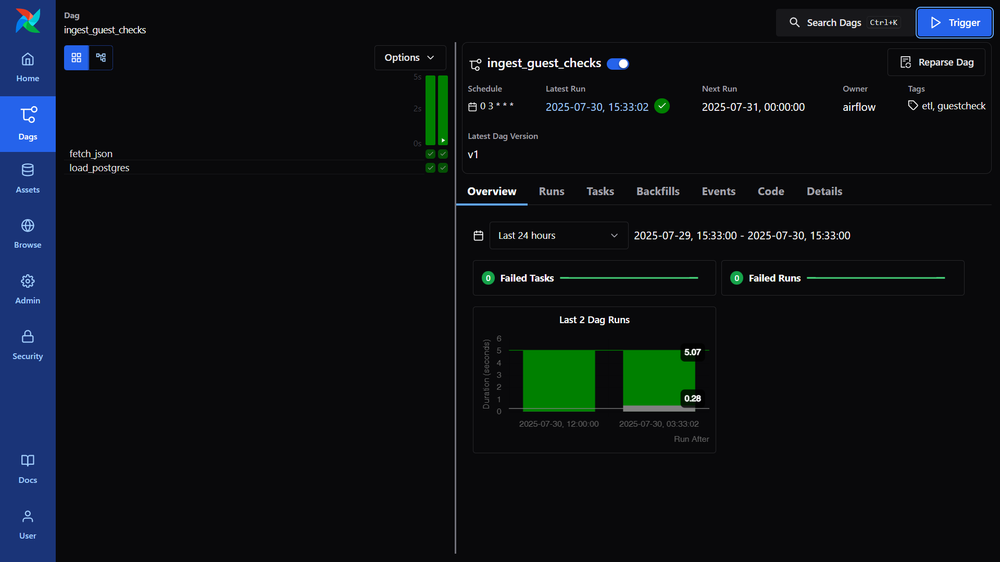
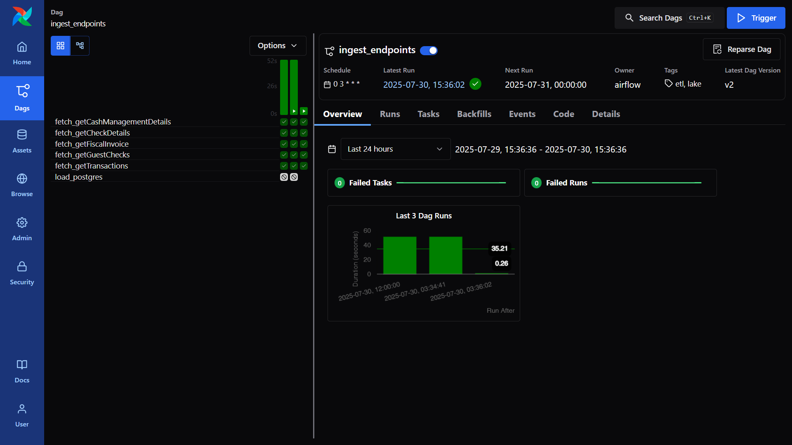

# Desafio CBLab

# Sobre
Repositório construído por Leonardo Alcântara, estudante de ciência da computação e entusiasta de dados. Projeto com foco em uma pipeline funcional para getGuestChecks; demais endpoints prototipados no lake.

Este projeto contém a solução para os desafios 1 e 2 de Engenharia de Dados Júnior da CBLab.
Ele apresenta um fluxo simples de ingestão de dados de pedidos de restaurante a
partir de um arquivo JSON para um banco PostgreSQL. O repositório inclui o script
ETL, a definição das tabelas, um DAG do Airflow e testes automatizados. Mantendo em mente as boas práticas da engenharia de dados, escalabilidade para aplicação em ambientes de produção e qualidade de código.

## Estrutura do repositório

- `src/parse_guestcheck.py` – Script responsável por carregar o JSON no banco.
- `dags/ingest_guest_checks.py` – DAG que realiza download (mock) do JSON e chama
  o parser.
- `sql/schema_warehouse.sql` – DDL com o modelo relacional utilizado.
- `docs/` – Documentação complementar e diagrama ER.
- `tests/` – Testes unitários utilizando Pytest.
- `docker-compose.yaml` – Para orquestração dos serviços com Airflow.

# Contexto para os desafios
   ## Desafio 1 - Modelagem de esquema, coleta e ingestão do JSON

   O primeiro desafio apresenta um JSON extraído de uma API ERP de um dos restaurantes, é necessário analisar e compreender os esquema do JSON para uma boa modelagem de dados, de acordo que as tabelas representem entidades reais de um sistema de restaurante e possam realizar operações comuns em um restaurante.

   Além disso é necessário tratar informações condicionais como menuItem, discount, tenderMedia, serviceCharge, errorCode.

   ## Payload
   `src/data/ERP.JSON`

   ## Solução

   Criei uma pipeline ETL `src/parse_guestcheck.py` que é capaz de coletar o JSON, extrair seus dados, realizar as transformações necessárias e carregar o resultado final em uma base de dados, essa pipeline é automatizada por meio de Apache Airflow, sendo capaz de programar a execução do arquivo para horários onde há pouco uso computacional.

   Modelei um esquema capaz de representar entidades e realizar operações de um restaurante, facilmente aplicável em produção usando `docker-compose.yml` e `schema_warehouse.sql`. O esquema e a utilização de docker também facilita mudanças e evoluções no banco.

   ## Desafio 2 — Datalake e respostas de API

   Somos apresentados com 5 end-points de uma API da rede de restaurante, precisamos justificar a importância de por que guardar as respostas da API e como iríamos organizar as respostas dentro do data lake da empresa, levando em consideração possíveis mudanças futuras e manter a velocidade das operações de manipulação, verificação, busca e pesquisa

   ## Endpoints a consumir
   - /bi/getFiscalInvoice
   - /res/getGuestChecks
   - /org/getChargeBack
   - /trans/getTransactions
   - /inv/getCashManagementDetails

   ## Solução
   Construí uma estrutura Medallion (Bronze -> Prata -> Ouro) que guarda arquivos crus (raw) no datalake, tranforme os arquivos para uso pela equipe de BI e Machine learning (Prata), carregue o resultado em nosso banco de dados para fácil acesso estruturado (Ouro).

   O data lake é construído usando uma arquitetura baseada nos padrões utilizados no mercado, separando os arquivos baseado em endpoints, datas e store_id. É possível observar a estrutura em `datalake/`, como em `datalake/getGuestChecks/ano=2025/mes=07/dia=29/loja=0001`
   
   
   # Configuração do Ambiente
   Pré-requisitos:
   - Ter Docker e Docker Compose instalados.
   - Ter o Python 3.10 ou superior instalado.
   - Criar um arquivo `.env` a partir do arquivo `.env.example` e preencher as variáveis de ambiente necessárias.
   - Ter o Airflow instalado e configurado na pasta do projeto. (https://airflow.apache.org/docs/apache-airflow/stable/howto/docker-compose/index.html)
   - Adicionar nos volumes dos serviços (webserver, scheduler, worker) do Airflow no `docker-compose.yaml`:
      ```yaml
      ./dags:/opt/airflow/dags
      ./data_lake:/opt/airflow/data_lake
      ./src:/opt/airflow/src
   ## Passos para rodar o projeto
   1. Clone o repositório:
      ```bash
      git clone https://github.com/MisterEight/desafio_cblab.git
      cd desafio_cblab
      ```
   2. Instale as dependências:
      ```bash
      pip install -r requirements.txt
      ```
   3. Execute o Docker Compose para subir o banco de dados PostgreSQL:
      ```bash
      docker-compose up -d
      ```
   4. Execute o script de parse do JSON para carregar os dados no banco (Desafio 1):
      ```bash
      python src/parse_guestcheck.py src/data/ERP.json
      ```
   5. Inicie o Airflow para executar o DAG de ingestão(Desafio 2):
      ```bash
      docker compose -f docker-compose-airflow.yaml up airflow-init
      docker compose -f docker-compose-airflow.yaml up -d
      ```
   6. Acesse a interface do Airflow em `http://localhost:8080` e execute o DAG `ingest_guest_checks`.
      
      
   6. Teste os testes unitários (O projeto também possuí github actions para rodar os testes automaticamente):
      ```bash
      pytest tests/
      ```
   # Considerações Finais
   O esquema do JSON foi analisado e modelado para refletir as entidades reais de um sistema de restaurante, permitindo operações comuns como consultas, inserções e atualizações. A solução proposta é escalável e modular, facilitando expansões e manutenções futuras.

   Docker Compose e Airflow foram utilizados para garantir um ambiente de desenvolvimento consistente e automatizado, permitindo fácil integração e orquestração dos processos de ETL.

   Os scripts de ETL foram implementados para realizar a extração, transformação e carga dos dados de maneira eficiente, garantindo a qualidade e integridade das informações no data lake e no banco de dados.

   O Data lake foi estruturado de forma a permitir fácil acesso e manipulação dos dados, seguindo as melhores práticas de organização e particionamento, o que facilita consultas e análises futuras.

   # Possíveis melhorias
   - Implementar mais testes unitários para garantir a robustez do código. 
   - Adicionar monitoramento e alertas no Airflow para falhas na execução dos DAGs.
   - Conexão com um provedor como Google Cloud Storage ou Amazon S3 para armazenar o data lake em nuvem, garantindo maior escalabilidade e disponibilidade.
   - Implementar um catálogo de dados para facilitar a descoberta e o uso dos dados armazenados no data lake.